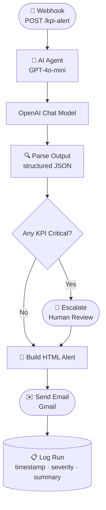

<div align="center">

# 🏭 n8n Warehouse KPI Alert Agent

**Real-time warehouse intelligence — webhook in, color-coded alert email out, zero manual monitoring.**

[](https://n8n.io)
[](https://openai.com)
[](https://developers.google.com/gmail)
[](LICENSE)

</div>

---

## What It Does

Send a JSON payload of warehouse KPIs to a webhook. The AI agent classifies every metric against its threshold, escalates critical breaches for human review, and fires a color-coded HTML alert email — all in seconds.

```
Webhook POST  →  AI Classification  →  Severity Routing  →  HTML Email + Log
```

---

## Features

- **Instant webhook ingestion** — accepts any warehouse, any number of KPIs, no schema changes needed
- **AI-powered classification** — GPT-4o-mini evaluates each KPI against its threshold and returns OK / WARNING / CRITICAL
- **Automatic escalation** — any CRITICAL KPI triggers a human-review flag before the email goes out
- **Color-coded HTML email** — 🟢 OK · 🟡 WARNING · 🔴 CRITICAL, rendered inline for any email client
- **Audit log** — every run is recorded with timestamp, severity, and summary

---

## Workflow — n8n Canvas

<div align="center">

<br/>
<sub>Live n8n workflow: webhook → AI agent → severity routing → HTML email + log</sub>
</div>

---

## How It Works



### Node-by-node

| Step | Node | What happens |
|------|------|-------------|
| 1 | **Webhook** | Receives POST with warehouse name + KPI array |
| 2 | **AI Agent** | Sends KPI data to GPT-4o-mini with classification prompt |
| 3 | **OpenAI Chat Model** | Returns OK / WARNING / CRITICAL for each metric |
| 4 | **Parse Output** | Converts AI response to structured JSON |
| 5 | **Any KPI critical?** | Branches on whether any metric hit CRITICAL |
| 6 | **Escalate** | Adds human-review flag to the alert payload |
| 7 | **Build HTML alert** | Renders color-coded email body |
| 8 | **Send email (Gmail)** | Fires alert via Gmail OAuth |
| 9 | **Log run** | Records timestamp, severity, and summary |

---

## KPI Classification

| Severity | Meaning | Email colour |
|----------|---------|-------------|
| 🟢 OK | Value within threshold | Green |
| 🟡 WARNING | Value approaching threshold | Amber |
| 🔴 CRITICAL | Value breached threshold | Red — escalates for human review |

---

## Output — Alert Email

<div align="center">

<br/>
<sub>Color-coded HTML email — one row per KPI, severity highlighted inline</sub>
</div>

---

## Live Endpoint

```
POST https://pritmon.app.n8n.cloud/webhook/kpi-alert
Content-Type: application/json
```

### Sample Payload

```json
{
  "warehouse": "DC-Bangalore-01",
  "kpis": [
    { "name": "Open Putaway Tasks",           "value": 240, "threshold": 150 },
    { "name": "Pending Outbound Deliveries",  "value": 38,  "threshold": 50  },
    { "name": "Dock Door Utilization %",      "value": 94,  "threshold": 85  },
    { "name": "Stock Discrepancies",          "value": 12,  "threshold": 5   }
  ]
}
```

This payload produces **2 CRITICAL** alerts (Putaway Tasks + Dock Door Utilization + Stock Discrepancies) and triggers escalation.

---

## Stack

| Layer | Tool |
|-------|------|
| Workflow automation | [n8n Cloud](https://n8n.io) |
| AI classification | GPT-4o-mini via OpenAI API |
| LLM orchestration | LangChain (n8n AI Agent node) |
| Email delivery | Gmail OAuth API |

---

## Repo Structure

```
n8n-warehouse-kpi-agent/
├── workflow.json                    # importable n8n workflow — all nodes & config
├── Warehouse KPI Alert Agent.json   # alternate export (named version)
└── README.md
```

---

## Quick Setup

1. **Import** `workflow.json` into your n8n instance
2. **OpenAI** — add your API key on the Chat Model node
3. **Gmail** — connect OAuth on the Send Email node
4. **Activate** the workflow — the webhook URL goes live instantly

---

## Testing

```bash
curl -X POST https://pritmon.app.n8n.cloud/webhook/kpi-alert \
  -H "Content-Type: application/json" \
  -d '{
    "warehouse": "DC-Bangalore-01",
    "kpis": [
      { "name": "Open Putaway Tasks", "value": 240, "threshold": 150 },
      { "name": "Stock Discrepancies", "value": 12, "threshold": 5 }
    ]
  }'
```

You'll receive the alert email within seconds.

---

<div align="center">
<sub>Built by <a href="https://github.com/pritmon">pritmon</a> · n8n · OpenAI · Gmail API</sub>
</div>
